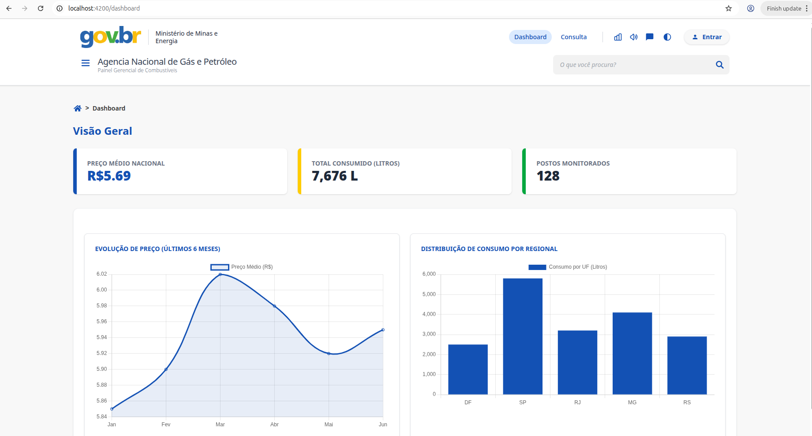
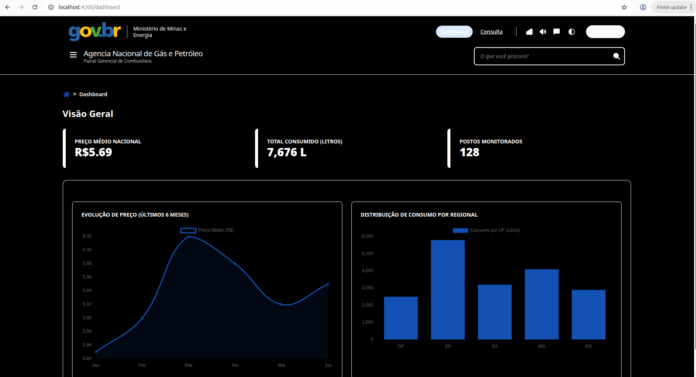
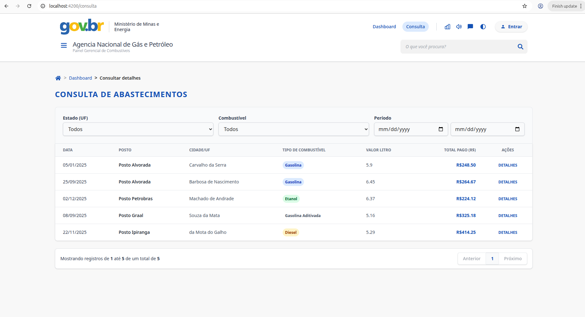
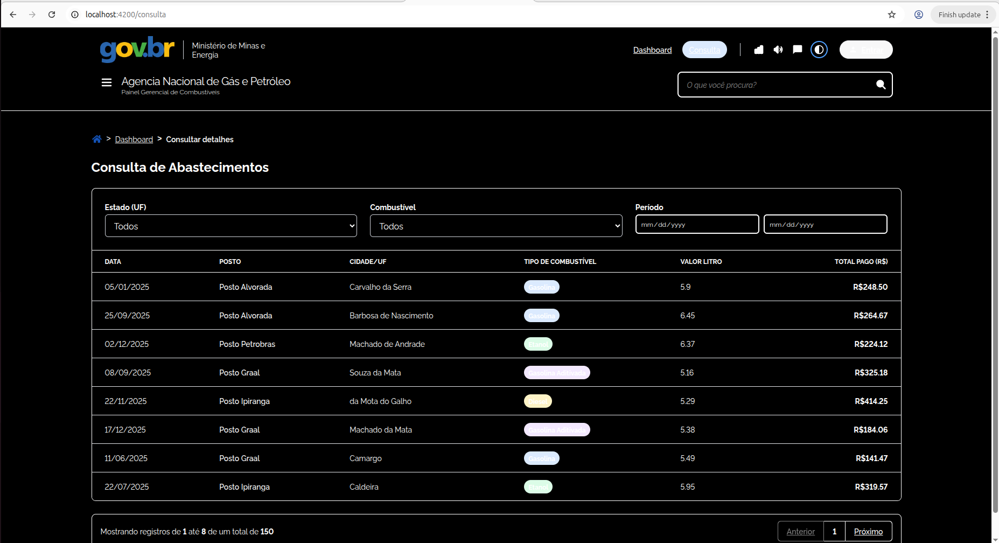
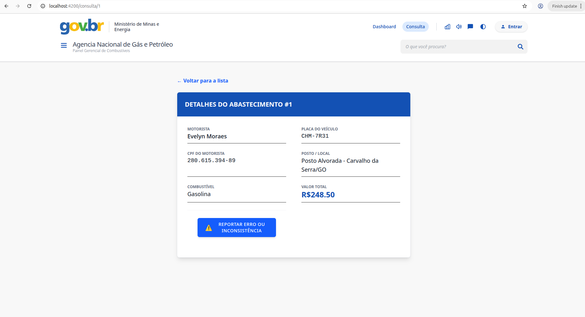
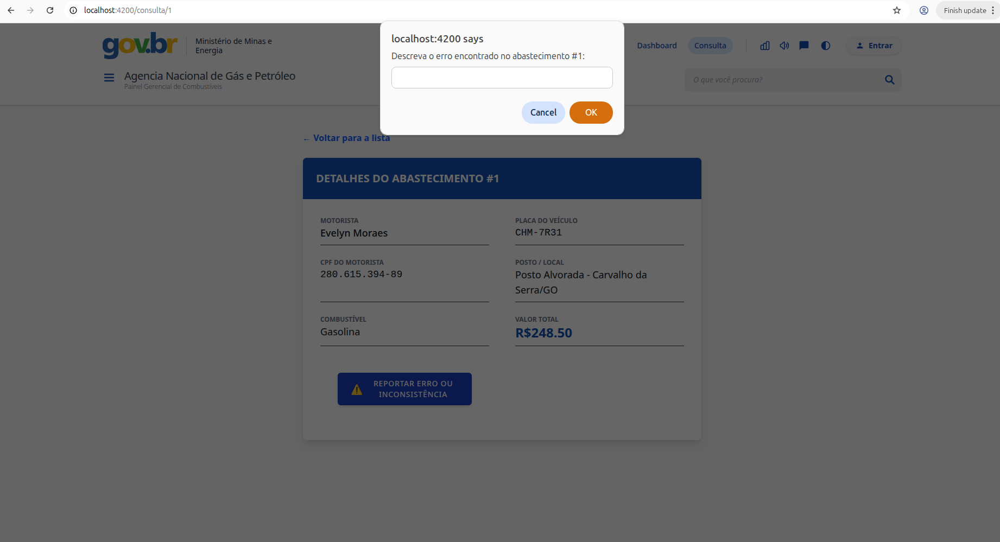
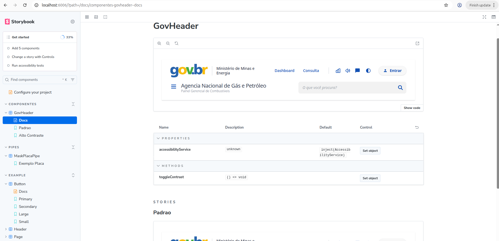
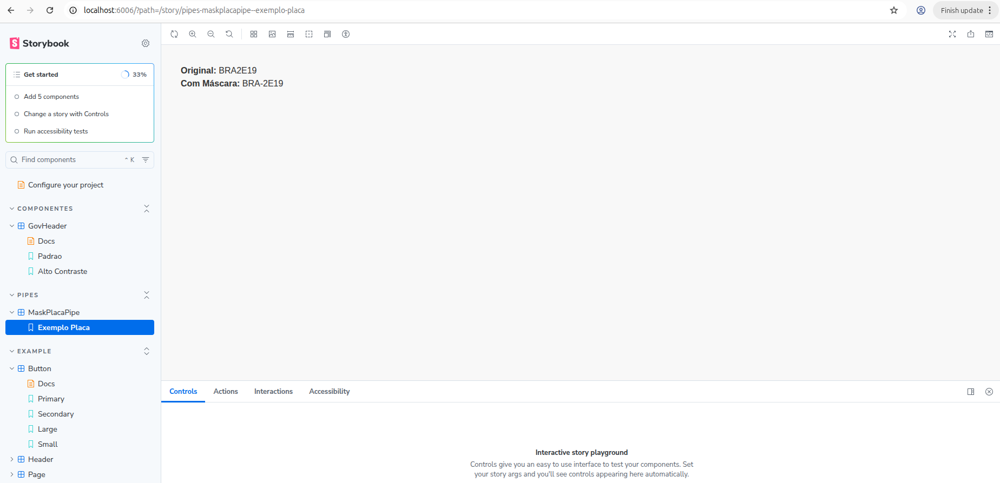

# 📊 Dashboard de Combustíveis — Setor de Transportes (V-Lab)

**•** Este projeto é uma aplicação frontend moderna desenvolvida como parte do desafio técnico da V-Lab para candidatos à vaga de Estágio/Graduação.

**•** O objetivo é fornecer aos gestores do setor de transportes uma visão gerencial clara e confiável sobre o consumo e o preço de combustíveis da frota nacional, seguindo rigorosamente o Padrão Digital de Governo (DSGOV).

## 🚀 Diferenciais Implementados

- 🐍 Automação de Dados com Python (Item 5)
Para testar a performance da tabela e a visualização dos gráficos com um volume real de informações, foi desenvolvido um script de automação que gera uma massa de dados aleatória e realista.

**Pré-requisitos**
* Python 3.12+
* Biblioteca `Faker`

**Como Gerar a Massa de Dados**
Se desejar atualizar o arquivo `db.json` com novos registros (como CPFs, placas e valores aleatórios), siga os passos abaixo na raiz do projeto:

 **Criar e ativar o ambiente virtual:**

```bash
pthon3 -m venv venv
source venv/bin/activate  # No Linux/macOS
# venv\Scripts\activate   # No Windows
# pip install faker        # instalar dependências
# python3 generate_data.py # executar o script para gerar a massa de dados
```
* **♿ Acessibilidade Proativa (WCAG):** Implementação de modo de **Alto Contraste** funcional 

**Deploy da aplicação na vercel**
```bash
combust-veis-dashboard-vlab-fmiouan2j-alissonjcjks-projects.vercel.app
```
* **Storybook (Documentação Visual):** Catálogo de componentes isolado, permitindo que designers e desenvolvedores visualizem e interajam com a UI sem depender do backend.

**aplicação de testes altomatizados com Jasmine**

## 🧰 Tecnologias Utilizadas

**•** Framework: Angular 21

**•** Linguagem: TypeScript

**•** Estilização: Tailwind CSS (cores oficiais #1351B4, #0C326F)

**•** Gerenciamento de Estado: Pattern Facade com Observables (RxJS)

**•** Gráficos: Chart.js

**•** Mock de API: JSON Server

### 📊 Funcionalidades Implementadas
#### 🧭 Header e Layout (Gov.br)

**•** Barra institucional do Governo Federal

**•** Links de acessibilidade

**•** Navegação principal (Dashboard / Consulta)

**•** Breadcrumbs para navegação estrutural

#### 📈 Dashboard — Visão Gerencial

**•** KPIs

**•** Preço médio nacional (Gasolina / Diesel)

**•** Total de litros consumidos

**•** Quantidade de postos monitorados

**•** Gráficos

**•** Evolução do preço nos últimos 6 meses

**•** Consumo por estado (UF)

#### 📋 Consulta de Abastecimentos

**•** Tabela de registros contendo:

- Data

- Posto

- Cidade / UF

- Tipo de combustível

- Valor por litro

- Total pago

#### Filtros avançados:

- Estado (UF)

- Tipo de combustível

- Período (data)

- Paginação

#### 🔍 Detalhe do Registro

**•** Informações do motorista e veículo

- Nome

- CPF (mascarado)

- Placa

- Botão “Reportar Erro” (simulação via modal / console.log)

## 🗂️ Estrutura do Projeto

O projeto segue uma arquitetura modular e escalável, separando claramente responsabilidades:

```text
src/app/
├── core/        # Serviços globais, Facades e lógica de negócio
├── shared/      # Componentes reutilizáveis (Header, Cards, Botões), Pipes e UI Kit
├── features/    # Módulos principais (Dashboard, Consulta, Detalhes)
└── .storybook/  # Configurações e documentação visual dos componentes

####▶️ Como Executar o Projeto

1️⃣ Clonar o repositório
git clone https://github.com/SEU_USUARIO/gov-combustiveis-dashboard.git
cd gov-combustiveis-dashboard

2️⃣ Instalar dependências
npm install ou npm install --legacy-peer-deps (caso haja incompatibilidade com o storybooking)

3️⃣ Executar aplicação + API mock
npm run dev


Aplicação: http://localhost:4200

API Mock: http://localhost:3000

4️⃣ Abrir o Storybook (Catálogo de componentes)
npm run storybook

5️⃣ Executar os Testes Unitários
npm test


### 🇧🇷 Padrão Digital de Governo (DSGOV)

A interface foi construída seguindo as diretrizes do Gov.br, incluindo:

Uso da paleta de cores oficial

Tipografia recomendada (Montserrat / Rawline)

Navegação clara com breadcrumbs

Atenção à acessibilidade e usabilidade

## 👤 Autor

Alisson da Silva Bernardino
Candidato à vaga de Estágio/Graduação — V-Lab

## 📸 Screenshots

#### 📊 Dashboard Gerencial
Visualização principal com indicadores (KPIs) e gráficos de consumo e preço médio.
| Modo Padrão | Modo Alto Contraste |
|---|---|
|  |  |

#### 📋 Consulta de Abastecimentos
Tabela dinâmica com filtros avançados e paginação.
| Listagem Normal | Listagem Alto Contraste |
|---|---|
|  |  |

#### 🔍 Detalhes e Interações
Visão detalhada do registro e simulação de reporte de erros.
| Detalhe do Abastecimento | Reportar Erro |
|---|---|
|  |  |

#### 🎨 Documentação Visual (Storybook)
Componentes e pipes isolados e documentados para o Design System.
| Header Institucional | Pipe de Máscara |
|---|---|
|  |  |
